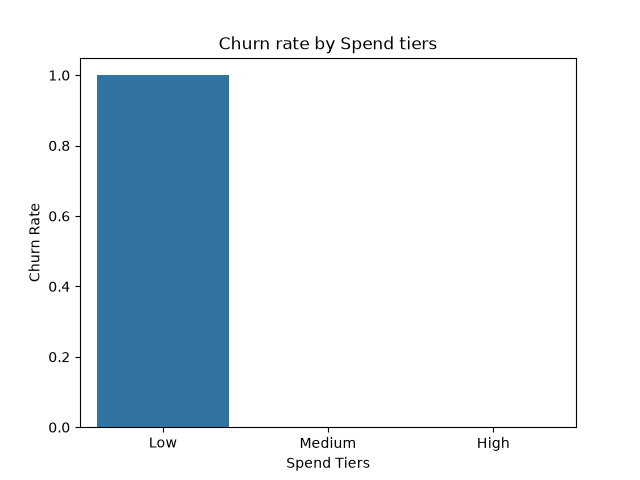

# Customer Segmentation & Churn Analysis

A Python data analysis project exploring customer behavior patterns to identify churn risk factors, using segmentation and visualization.

## What It Does

Given customer data (age, monthly spend, tenure, churn status), the program:
- Explores distributions of age and spending via histograms
- Compares spending patterns between churned and retained customers via boxplot
- Segments customers into spend tiers (Low/Medium/High) and tenure tiers (New/Established/Loyal)
- Calculates churn rate by segment
- Visualizes churn rate by spend tier for a non-technical audience

## Key Findings

- Customers in the **Low** spend tier and **New** tenure tier show a 100% churn rate in this dataset, while Medium/High spend and Established/Loyal tenure customers show 0% churn.
- **Caveat 1:** This clean separation is likely partly an artifact of the small sample size (20 customers) — a real-world dataset would almost certainly show more overlap between groups.
- **Caveat 2:** Spend tier and tenure tier are almost perfectly correlated with each other in this dataset (confirmed via crosstab) — Low spend customers are always New, Medium spend customers are always Established, High spend customers are almost always Loyal. This suggests they aren't two independent risk signals, but largely the same underlying pattern (customer tenure) expressed two ways. In a predictive model, these features would likely be redundant (multicollinear) rather than complementary.

## Example Output



## How to Run

```bash
pip install pandas numpy matplotlib seaborn jupyter
jupyter notebook churn_analysis.ipynb
```

Then run all cells from top to bottom.

## Skills Practiced

- Exploratory data analysis (histograms, boxplots)
- Customer segmentation via custom binning functions
- GroupBy aggregation for rate calculations (mean of a 0/1 column)
- Cross-tabulation to detect feature redundancy/multicollinearity
- Chart design for non-technical stakeholders (honest axes, clear labels)

## Possible Improvements

- Test findings against a larger, real-world dataset to check if the clean separation holds
- Engineer a single combined "customer lifecycle" feature instead of two redundant tier columns
- Extend to a predictive model (e.g., logistic regression) now that key features are identified